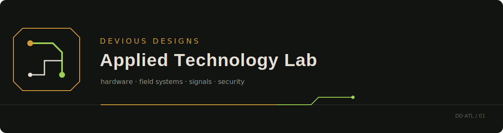

# Devious Designs Applied Technology Lab

> Independent research in hardware, embedded systems, wireless technology, radio, security, and field computing.

This repository is my working laboratory: part field notebook, part equipment reference, and part record of what happened when theory met the bench. It documents devices I own, modifications I have attempted, systems I have maintained, and the lessons—successful or otherwise—that came out of the work.

The goal is not to collect specifications that already exist elsewhere. The useful material here is firsthand: setup decisions, photographs, measurements, failures, repairs, comparisons, and observations that may help the next experiment.

## Lab index

| Area | What lives there | Status |
|---|---|---|
| [Hardware](Hardware-General/) | Device notes, accessories, pinouts, and ownership experience | Active |
| [Projects](projects/) | Work with a defined purpose, build, or field outcome | Active |
| [Signals research](SigInt/) | Lawful reception, spectrum study, and signal-analysis notes | Active |
| [Security research](Offensive%20%26%20Red%20Teaming/) | Controlled hardware-security and authorized testing | Active |
| [Test equipment](Tools%20For%20Testing/) | Instruments, bench tools, and software used to evaluate hardware | Planned |
| [Field notes](field-notes/) | Dated observations that do not yet belong to a full project | Planned |

## Current field project

### Wilmington Meshtastic Network

The [Wilmington Meshtastic Network](projects/wilmington-meshtastic-network/) records practical work maintaining LoRa mesh nodes: device selection, configurations, antennas, placements, repairs, coverage observations, and community-network planning.

## Working method

Every useful entry should make four things clear:

1. **Question** — what I wanted to learn or accomplish.
2. **Setup** — the exact hardware, software, firmware, and conditions.
3. **Observation** — what actually happened.
4. **Carry-forward** — what I would repeat, change, or investigate next.

Pages marked **Planned** are intentional placeholders for hardware already in the lab or research I expect to conduct. Empty categories without a credible next step are removed rather than left as scenery.

## Research boundaries

Material in this laboratory is documented for education, interoperability, defensive understanding, repair, and authorized security research. Experiments involving networks, identifiers, radio transmissions, or access controls are conducted only on owned equipment, suitable test environments, or systems where explicit permission exists.

## About the name

**Devious Designs** is the workshop identity. **Applied Technology Lab** describes the practice: learning by building, measuring, modifying, maintaining, and documenting real systems.

— Anthony McWhite

